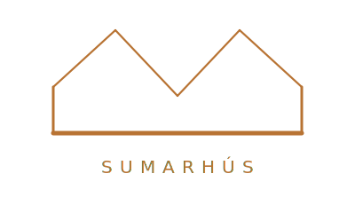
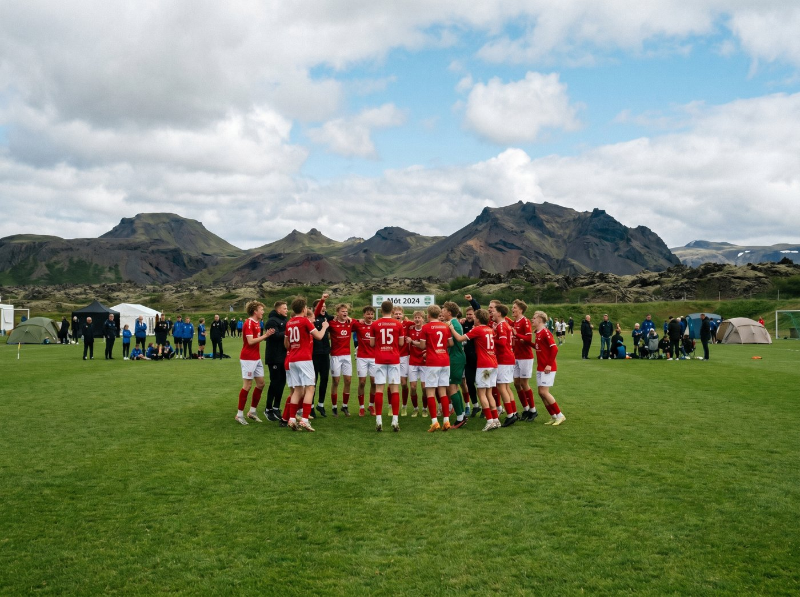

<p align="center">
  <a href="https://www.smarason.is">
    <picture>
      <source media="(prefers-color-scheme: dark)" srcset="assets/sumarhus-logo-white.svg">
      
    </picture>
  </a>
</p>

<h1 align="center">🏆 TM-mót 2026 — minningar af móti, sjálfvirkt</h1>

<p align="center">
  Segðu því bara <b>hvaða liði þú fylgdist með</b>. Það sækir söguna um allt mótið —<br>
  hvern leik, stöðuna, greininguna — parar hana við deilda myndaalbúmið þitt,<br>
  og býr til tvo minningagripi úr einni sameiginlegri heimild:<br>
  <b>lifandi, lokað mælaborð</b> og <b>ljósa, prentvæna minningabók í PDF</b>.
</p>

<p align="center">
  Tveir Claude&nbsp;Code skillar í einu repo · gert sem raunveruleg tilraun yfir eina
  mótshelgi<br>(KA-2 á TM-mótinu í Vestmannaeyjum, júní 2026) og síðan almennt yfirfært.
  <br><br>
  <b>eftir Magnús Smára Smárason</b> · <a href="https://www.smarason.is">smarason.is</a>
</p>

---

## Kerfið í einni mynd

```
        ┌──────────────────────────────────────────────────────────────────┐
        │  ÞÚ GEFUR AÐEINS:  liðið sem þú fylgdist með  +  hlekk á albúm      │
        └──────────────────────────────────────────────────────────────────┘
                              │                               │
              ┌───────────────┘                               └───────────────┐
              ▼                                                                ▼
   ┌─────────────────────┐                                       ┌──────────────────────┐
   │  ÚRSLITAVEITA (skipt-│                                       │  MYNDAHEIMILD (adapter)│
   │  anleg) t.d. tmmotid │                                       │  GPhotos·Dropbox·mappa │
   └──────────┬──────────┘                                       └───────────┬──────────┘
              │  erindreki + Python á millibili                               │  headless / API / FS
              │  skrapar aðeins spilaða leiki · ber saman · byggir við breytingu  frumrit + EXIF
              ▼                                                                ▼
   ╔═══════════ SKILL 1 · tmmot-results ═════════════════╗        ╔════ SKILL 2 · tmmot-album ════════╗
   ║  leikir · staðan · form hvers leiks                 ║        ║  EXIF-tími → hvaða leikur          ║
   ║  heildargreining mótsins · liðið í samhengi         ║        ║  STAÐBUNDIÐ myndalíkan (Gemma 3    ║
   ║  (valfrjálst) púls pabbans á hverjum leik           ║        ║  12B, á eigin vélbúnaði) lýsir og  ║
   ╚════════════════════════╤════════════════════════════╝        ║  raðar — myndir fara aldrei út     ║
                            │                                     ║  eigandinn velur forsíðu + gallerí  ║
                            ▼                                     ╚═══════════════╤═══════════════════╝
                  ┌───────────────────┐                                          │
                  │     data.json     │ ◄────────── ein sameiginleg heimild ─────┘
                  └─────────┬─────────┘
            ┌───────────────┴────────────────┐
            ▼                                 ▼
   ┌──────────────────────┐        ┌──────────────────────────┐
   │  LIFANDI MÆLABORÐ      │        │  MINNINGABÓK Í PDF        │
   │  núll-háð Node-þjónn   │        │  Quarto + xelatex         │
   │  PIN-lokað · liquid    │        │  LJÓS · prentvæn          │
   │  glass · dökkt (skjár) │        │  sömu fontar + merki      │
   └──────────────────────┘        └──────────────────────────┘
```

**Ein `data.json` → tveir miðlar, hvor sniðinn að sínum:** dökkt liquid-glass á skjánum,
ljós og blek-spör á pappír. Sömu fontar og sama merki, svo þeir lesast sem ein heild.

---

## Skillarnir tveir

| Skill | Gerir | Þú gefur því |
|---|---|---|
| **`tmmot-results`** | Sækir leiki liðsins, stöðuna og heildargreiningu mótsins af opinberu úrslitasíðunni. Keyrir á millibili; byggir aðeins við raunverulega breytingu. | **liðsnafnið** + slóð úrslitasíðunnar |
| **`tmmot-album`** | Harvestar deilda albúmið, raðar myndum á leiki eftir tíma, lýsir þeim með **staðbundnu** myndalíkani, lætur þig velja forsíðu + gallerí, og byggir lokaða mælaborðið + ljósu PDF-bókina. | **albúm-hlekkinn** + gögnin úr skilli 1 |

Settu `skills/tmmot-results/` og `skills/tmmot-album/` í Claude Code `~/.claude/skills/`
(eða í `.claude/skills/` verkefnis). Svo segirðu bara hvað þú vilt.

---

## Ófrávíkjanlegar meginreglur

- **Óháð söluaðilum (vendor-agnostic) — staðall hjá Sumarhúsum.** Ekkert er læst við
  einn þjónustuaðila. **Myndaheimildin er adapter:** Google Photos er aðeins einn —
  settu Dropbox, iCloud deilt albúm, **möppu á disknum** (alheims-leiðin, virkar
  strax), eða S3-fötu í staðinn. Sama gildir um úrslitaveituna, myndalíkanið
  (Gemma á eigin vélbúnaði, eða hvað sem er) og hýsinguna. Skiptu hverju sem er út.
- **Myndirnar eru ófalsaðar — og sé einhverju breytt er það tekið fram.** Engri mynd
  er breytt af kerfinu umfram það sem síminn sem tók hana gerir sjálfur. Myndalíkanið
  aðeins *lýsir og raðar*; það breytir aldrei mynd. Sé mynd breytt umfram það, segir
  síðan það skýrt.
- **Persónuvernd fyrst.** Börn á opnu interneti → `noindex`, robots `Disallow: /`, allt
  (þ.m.t. albúm-hlekkurinn) bak við PIN, engin nöfn barna nema í kveðjum sem eigandinn
  skrifar sjálfur. Myndalíkanið keyrir á **þínum** vélbúnaði; myndir fara aldrei út af honum.
- **Engin fals-græn gögn.** Aðeins leikir sem voru raunverulega spilaðir; „síðast
  uppfært" sýnilegt; handfærðir leikir merktir sem handfærðir.
- **Sannreyndu alla síðuna í alvöru vafra eftir hverja breytingu.** (Ein tilvísun utan
  skóps þurrkaði eitt sinn út alla JS-rendaðu síðuna á meðan einn reitur sást enn —
  að lesa einn reit er ekki sannreyning.)
- **Ljóst fyrir prent, gler fyrir skjá.** Dökkt full-bleed er rangt fyrir prentaða bók.

---

## Fljótbyrjun

```bash
# 1. úrslit — sæktu mótið fyrir liðið þitt
python3 skills/tmmot-results/tools/refresh-urslit.py      # breyttu TEAM + slóð efst

# 2. myndir — harvestaðu deilda albúmið, raðaðu á leiki
bash   skills/tmmot-album/tools/harvest-album.sh <albúm-hlekkur> ~/Pictures/<mót>
python3 skills/tmmot-album/tools/match-photos.py

# 3. velja + byggja — staðbundinn mynda-editor → ljós PDF + síðu-gallerí + deploy
python3 skills/tmmot-album/tools/editor.py                # → http://localhost:8765

# 4. síðan — keyrir hvar sem Docker + göng keyra
cp -r skills/tmmot-album/templates/* apps/<mót>/ && docker compose up -d --build
```

---

## Sýnishorn — sjáðu minningabókina

Heil sýnis-minningabók: **[`demo/minningabok-demo.pdf`](demo/minningabok-demo.pdf)**.
Allt í henni er **uppspuni** — liðið *Eldey U11*, úrslitin og myndirnar (gerðar með
myndalíkani, **ekkert raunverulegt fólk**) — svo óhætt er að deila henni á meðan hún
sýnir nákvæmlega það sem kerfið býr til úr alvöru móti. Endurbyggðu hana sjálf með
`python3 demo/build-mock.py`.

<p align="center">
  
</p>

> Sérhver mynd á alvöru síðu er **ófölsuð** umfram það sem síminn gerir; sýnishorns-
> myndirnar eru skýrt merktar sem gerðar. Sé einhverju breytt er það tekið fram.

---

*Gerðu það að þínu.* Skiptu út opinberu úrslitasíðunni, albúm-heimildinni, staðbundna
líkaninu, litunum og merkinu. Hryggjarstykkið — ein `data.json` → lokuð skjáupplifun +
ljós prentanleg bók, sannreynt í alvöru vafra — er það sem er þess virði að halda.

MIT-leyfi. Gert með [Claude Code](https://claude.com/claude-code).
